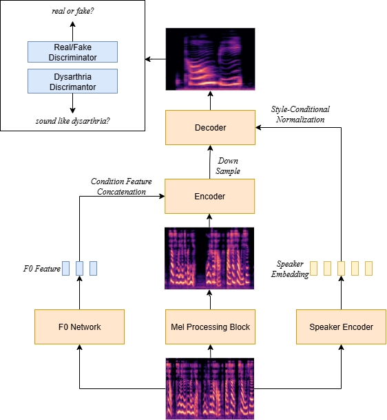

(Submitted on Interspeech 2025)

## 1. Abstract

Dysarthric speech reconstruction aims to transform impaired and unintelligible speech into clear, natural, and intelligible speech while preserving the speaker’s unique timbre. Dysarthric speech reconstruction faces challenges such as insufficient speaker similarity, limited speech intelligibility, slow inference speed, and the scarcity of research on Chinese dysarthric speech conversion. In this paper, we propose a Mamba-based dysarthric speech reconstruction model for Chinese speakers, which combines StarGAN and Mamba, achieves fast inference, and does not require healthy speech as a reference for inference. Our model consists of a Mamba-based Rapid Spectrogram Refinement (RSR) block, a timbre encoder,encoder and decoder built with adaptive instance normalization, and a discriminator that enhances both the naturalness and intelligibility of the generated speech. Our model achieves a CER of \textbf{18.1\%}, representing a \textbf{9.1\%} improvement over the conventional Conformer, reaches an inference RTF of \textbf{0.21} on 4090D, and obtains the best MOS among relevant models.

## 2. Proposed Model Architecture

## 3. Comparison with Different Baseline Systems

- **FS2-DSR**: It uses a speaker encoder to extract a global timbre embedding and a multi-speaker mel-based decoder.
- **CoLM-DSR**: Excluding the influence of multi-modal input, it uses a LM-based generator with speech codec prompt.
- **Diff-DSR**: Our complete proposed diffusion based system.

### 3.1 Speaker: M12

3.1.1 **Text**: <i>Left</i>

<table class="custom-table">
  <thead>
    <tr>
      <th>Original</th>
      <th>FS2-DSR</th>
      <th>CoLM-DSR</th>
      <th>Diff-DSR</th>
    </tr>
  </thead>
  <tbody>
    <tr>
      <td><audio controls style="width: 219px;"><source src="./data/M12/Original/Left.wav" type="audio/wav"></audio></td>
      <td><audio controls style="width: 219px;"><source src="./data/M12/FS2-DSR/Left.wav" type="audio/wav"></audio></td>
      <td><audio controls style="width: 219px;"><source src="./data/M12/CoLM-DSR/Left.wav" type="audio/wav"></audio></td>
      <td><audio controls style="width: 219px;"><source src="./data/M12/Diff-DSR/Left.wav" type="audio/wav"></audio></td>
    </tr>
  </tbody>
</table>

3.1.2 **Text**: <i>Juliet</i>

<table class="custom-table">
  <thead>
    <tr>
      <th>Original</th>
      <th>FS2-DSR</th>
      <th>CoLM-DSR</th>
      <th>Diff-DSR</th>
    </tr>
  </thead>
  <tbody>
    <tr>
      <td><audio controls style="width: 219px;"><source src="./data/M12/Original/Juliet.wav" type="audio/wav"></audio></td>
      <td><audio controls style="width: 219px;"><source src="./data/M12/FS2-DSR/Juliet.wav" type="audio/wav"></audio></td>
      <td><audio controls style="width: 219px;"><source src="./data/M12/CoLM-DSR/Juliet.wav" type="audio/wav"></audio></td>
      <td><audio controls style="width: 219px;"><source src="./data/M12/Diff-DSR/Juliet.wav" type="audio/wav"></audio></td>
    </tr>
  </tbody>
</table>

3.1.3 **Text**: <i>Whiskey</i>

<table class="custom-table">
  <thead>
    <tr>
      <th>Original</th>
      <th>FS2-DSR</th>
      <th>CoLM-DSR</th>
      <th>Diff-DSR</th>
    </tr>
  </thead>
  <tbody>
    <tr>
      <td><audio controls style="width: 219px;"><source src="./data/M12/Original/Whiskey.wav" type="audio/wav"></audio></td>
      <td><audio controls style="width: 219px;"><source src="./data/M12/FS2-DSR/Whiskey.wav" type="audio/wav"></audio></td>
      <td><audio controls style="width: 219px;"><source src="./data/M12/CoLM-DSR/Whiskey.wav" type="audio/wav"></audio></td>
      <td><audio controls style="width: 219px;"><source src="./data/M12/Diff-DSR/Whiskey.wav" type="audio/wav"></audio></td>
    </tr>
  </tbody>
</table>

3.1.4 **Text**: <i>Many</i>

<table class="custom-table">
  <thead>
    <tr>
      <th>Original</th>
      <th>FS2-DSR</th>
      <th>CoLM-DSR</th>
      <th>Diff-DSR</th>
    </tr>
  </thead>
  <tbody>
    <tr>
      <td><audio controls style="width: 219px;"><source src="./data/M12/Original/Many.wav" type="audio/wav"></audio></td>
      <td><audio controls style="width: 219px;"><source src="./data/M12/FS2-DSR/Many.wav" type="audio/wav"></audio></td>
      <td><audio controls style="width: 219px;"><source src="./data/M12/CoLM-DSR/Many.wav" type="audio/wav"></audio></td>
      <td><audio controls style="width: 219px;"><source src="./data/M12/Diff-DSR/Many.wav" type="audio/wav"></audio></td>
    </tr>
  </tbody>
</table>

3.1.5 **Text**: <i>Golf</i>

<table class="custom-table">
  <thead>
    <tr>
      <th>Original</th>
      <th>FS2-DSR</th>
      <th>CoLM-DSR</th>
      <th>Diff-DSR</th>
    </tr>
  </thead>
  <tbody>
    <tr>
      <td><audio controls style="width: 219px;"><source src="./data/M12/Original/Golf.wav" type="audio/wav"></audio></td>
      <td><audio controls style="width: 219px;"><source src="./data/M12/FS2-DSR/Golf.wav" type="audio/wav"></audio></td>
      <td><audio controls style="width: 219px;"><source src="./data/M12/CoLM-DSR/Golf.wav" type="audio/wav"></audio></td>
      <td><audio controls style="width: 219px;"><source src="./data/M12/Diff-DSR/Golf.wav" type="audio/wav"></audio></td>
    </tr>
  </tbody>
</table>

3.1.6 **Text**: <i>Watch</i>

<table class="custom-table">
  <thead>
    <tr>
      <th>Original</th>
      <th>FS2-DSR</th>
      <th>CoLM-DSR</th>
      <th>Diff-DSR</th>
    </tr>
  </thead>
  <tbody>
    <tr>
      <td><audio controls style="width: 219px;"><source src="./data/M12/Original/Watch.wav" type="audio/wav"></audio></td>
      <td><audio controls style="width: 219px;"><source src="./data/M12/FS2-DSR/Watch.wav" type="audio/wav"></audio></td>
      <td><audio controls style="width: 219px;"><source src="./data/M12/CoLM-DSR/Watch.wav" type="audio/wav"></audio></td>
      <td><audio controls style="width: 219px;"><source src="./data/M12/Diff-DSR/Watch.wav" type="audio/wav"></audio></td>
    </tr>
  </tbody>
</table>

### 3.2 Speaker: F02

3.2.1 **Text**: <i>Paragraph</i>

<table class="custom-table">
  <thead>
    <tr>
      <th>Original</th>
      <th>FS2-DSR</th>
      <th>CoLM-DSR</th>
      <th>Diff-DSR</th>
    </tr>
  </thead>
  <tbody>
    <tr>
      <td><audio controls style="width: 219px;"><source src="./data/F02/Original/Paragraph.wav" type="audio/wav"></audio></td>
      <td><audio controls style="width: 219px;"><source src="./data/F02/FS2-DSR/Paragraph.wav" type="audio/wav"></audio></td>
      <td><audio controls style="width: 219px;"><source src="./data/F02/CoLM-DSR/Paragraph.wav" type="audio/wav"></audio></td>
      <td><audio controls style="width: 219px;"><source src="./data/F02/Diff-DSR/Paragraph.wav" type="audio/wav"></audio></td>
    </tr>
  </tbody>
</table>

3.2.2 **Text**: <i>Word</i>

<table class="custom-table">
  <thead>
    <tr>
      <th>Original</th>
      <th>FS2-DSR</th>
      <th>CoLM-DSR</th>
      <th>Diff-DSR</th>
    </tr>
  </thead>
  <tbody>
    <tr>
      <td><audio controls style="width: 219px;"><source src="./data/F02/Original/Word.wav" type="audio/wav"></audio></td>
      <td><audio controls style="width: 219px;"><source src="./data/F02/FS2-DSR/Word.wav" type="audio/wav"></audio></td>
      <td><audio controls style="width: 219px;"><source src="./data/F02/CoLM-DSR/Word.wav" type="audio/wav"></audio></td>
      <td><audio controls style="width: 219px;"><source src="./data/F02/Diff-DSR/Word.wav" type="audio/wav"></audio></td>
    </tr>
  </tbody>
</table>

3.2.3 **Text**: <i>When</i>

<table class="custom-table">
  <thead>
    <tr>
      <th>Original</th>
      <th>FS2-DSR</th>
      <th>CoLM-DSR</th>
      <th>Diff-DSR</th>
    </tr>
  </thead>
  <tbody>
    <tr>
      <td><audio controls style="width: 219px;"><source src="./data/F02/Original/When.wav" type="audio/wav"></audio></td>
      <td><audio controls style="width: 219px;"><source src="./data/F02/FS2-DSR/When.wav" type="audio/wav"></audio></td>
      <td><audio controls style="width: 219px;"><source src="./data/F02/CoLM-DSR/When.wav" type="audio/wav"></audio></td>
      <td><audio controls style="width: 219px;"><source src="./data/F02/Diff-DSR/When.wav" type="audio/wav"></audio></td>
    </tr>
  </tbody>
</table>

3.2.4 **Text**: <i>Seven</i>

<table class="custom-table">
  <thead>
    <tr>
      <th>Original</th>
      <th>FS2-DSR</th>
      <th>CoLM-DSR</th>
      <th>Diff-DSR</th>
    </tr>
  </thead>
  <tbody>
    <tr>
      <td><audio controls style="width: 219px;"><source src="./data/F02/Original/Seven.wav" type="audio/wav"></audio></td>
      <td><audio controls style="width: 219px;"><source src="./data/F02/FS2-DSR/Seven.wav" type="audio/wav"></audio></td>
      <td><audio controls style="width: 219px;"><source src="./data/F02/CoLM-DSR/Seven.wav" type="audio/wav"></audio></td>
      <td><audio controls style="width: 219px;"><source src="./data/F02/Diff-DSR/Seven.wav" type="audio/wav"></audio></td>
    </tr>
  </tbody>
</table>

3.2.5 **Text**: <i>Foxtrot</i>

<table class="custom-table">
  <thead>
    <tr>
      <th>Original</th>
      <th>FS2-DSR</th>
      <th>CoLM-DSR</th>
      <th>Diff-DSR</th>
    </tr>
  </thead>
  <tbody>
    <tr>
      <td><audio controls style="width: 219px;"><source src="./data/F02/Original/Foxtrot.wav" type="audio/wav"></audio></td>
      <td><audio controls style="width: 219px;"><source src="./data/F02/FS2-DSR/Foxtrot.wav" type="audio/wav"></audio></td>
      <td><audio controls style="width: 219px;"><source src="./data/F02/CoLM-DSR/Foxtrot.wav" type="audio/wav"></audio></td>
      <td><audio controls style="width: 219px;"><source src="./data/F02/Diff-DSR/Foxtrot.wav" type="audio/wav"></audio></td>
    </tr>
  </tbody>
</table>

### 3.3 Speaker: M16

3.3.1 **Text**: <i>Copy</i>

<table class="custom-table">
  <thead>
    <tr>
      <th>Original</th>
      <th>FS2-DSR</th>
      <th>CoLM-DSR</th>
      <th>Diff-DSR</th>
    </tr>
  </thead>
  <tbody>
    <tr>
      <td><audio controls style="width: 219px;"><source src="./data/M16/Original/Copy.wav" type="audio/wav"></audio></td>
      <td><audio controls style="width: 219px;"><source src="./data/M16/FS2-DSR/Copy.wav" type="audio/wav"></audio></td>
      <td><audio controls style="width: 219px;"><source src="./data/M16/CoLM-DSR/Copy.wav" type="audio/wav"></audio></td>
      <td><audio controls style="width: 219px;"><source src="./data/M16/Diff-DSR/Copy.wav" type="audio/wav"></audio></td>
    </tr>
  </tbody>
</table>

3.3.2 **Text**: <i>Bravo</i>

<table class="custom-table">
  <thead>
    <tr>
      <th>Original</th>
      <th>FS2-DSR</th>
      <th>CoLM-DSR</th>
      <th>Diff-DSR</th>
    </tr>
  </thead>
  <tbody>
    <tr>
      <td><audio controls style="width: 219px;"><source src="./data/M16/Original/Bravo.wav" type="audio/wav"></audio></td>
      <td><audio controls style="width: 219px;"><source src="./data/M16/FS2-DSR/Bravo.wav" type="audio/wav"></audio></td>
      <td><audio controls style="width: 219px;"><source src="./data/M16/CoLM-DSR/Bravo.wav" type="audio/wav"></audio></td>
      <td><audio controls style="width: 219px;"><source src="./data/M16/Diff-DSR/Bravo.wav" type="audio/wav"></audio></td>
    </tr>
  </tbody>
</table>

3.3.3 **Text**: <i>Kilo</i>

<table class="custom-table">
  <thead>
    <tr>
      <th>Original</th>
      <th>FS2-DSR</th>
      <th>CoLM-DSR</th>
      <th>Diff-DSR</th>
    </tr>
  </thead>
  <tbody>
    <tr>
      <td><audio controls style="width: 219px;"><source src="./data/M16/Original/Kilo.wav" type="audio/wav"></audio></td>
      <td><audio controls style="width: 219px;"><source src="./data/M16/FS2-DSR/Kilo.wav" type="audio/wav"></audio></td>
      <td><audio controls style="width: 219px;"><source src="./data/M16/CoLM-DSR/Kilo.wav" type="audio/wav"></audio></td>
      <td><audio controls style="width: 219px;"><source src="./data/M16/Diff-DSR/Kilo.wav" type="audio/wav"></audio></td>
    </tr>
  </tbody>
</table>

3.3.4 **Text**: <i>Oscar</i>

<table class="custom-table">
  <thead>
    <tr>
      <th>Original</th>
      <th>FS2-DSR</th>
      <th>CoLM-DSR</th>
      <th>Diff-DSR</th>
    </tr>
  </thead>
  <tbody>
    <tr>
      <td><audio controls style="width: 219px;"><source src="./data/M16/Original/Oscar.wav" type="audio/wav"></audio></td>
      <td><audio controls style="width: 219px;"><source src="./data/M16/FS2-DSR/Oscar.wav" type="audio/wav"></audio></td>
      <td><audio controls style="width: 219px;"><source src="./data/M16/CoLM-DSR/Oscar.wav" type="audio/wav"></audio></td>
      <td><audio controls style="width: 219px;"><source src="./data/M16/Diff-DSR/Oscar.wav" type="audio/wav"></audio></td>
    </tr>
  </tbody>
</table>

3.3.5 **Text**: <i>Tango</i>

<table class="custom-table">
  <thead>
    <tr>
      <th>Original</th>
      <th>FS2-DSR</th>
      <th>CoLM-DSR</th>
      <th>Diff-DSR</th>
    </tr>
  </thead>
  <tbody>
    <tr>
      <td><audio controls style="width: 219px;"><source src="./data/M16/Original/Tango.wav" type="audio/wav"></audio></td>
      <td><audio controls style="width: 219px;"><source src="./data/M16/FS2-DSR/Tango.wav" type="audio/wav"></audio></td>
      <td><audio controls style="width: 219px;"><source src="./data/M16/CoLM-DSR/Tango.wav" type="audio/wav"></audio></td>
      <td><audio controls style="width: 219px;"><source src="./data/M16/Diff-DSR/Tango.wav" type="audio/wav"></audio></td>
    </tr>
  </tbody>
</table>

3.3.6 **Text**: <i>Upward</i>

<table class="custom-table">
  <thead>
    <tr>
      <th>Original</th>
      <th>FS2-DSR</th>
      <th>CoLM-DSR</th>
      <th>Diff-DSR</th>
    </tr>
  </thead>
  <tbody>
    <tr>
      <td><audio controls style="width: 219px;"><source src="./data/M16/Original/Upward.wav" type="audio/wav"></audio></td>
      <td><audio controls style="width: 219px;"><source src="./data/M16/FS2-DSR/Upward.wav" type="audio/wav"></audio></td>
      <td><audio controls style="width: 219px;"><source src="./data/M16/CoLM-DSR/Upward.wav" type="audio/wav"></audio></td>
      <td><audio controls style="width: 219px;"><source src="./data/M16/Diff-DSR/Upward.wav" type="audio/wav"></audio></td>
    </tr>
  </tbody>
</table>

### 3.4 Speaker: F04

3.4.1 **Text**: <i>Bulrush</i>

<table class="custom-table">
  <thead>
    <tr>
      <th>Original</th>
      <th>FS2-DSR</th>
      <th>CoLM-DSR</th>
      <th>Diff-DSR</th>
    </tr>
  </thead>
  <tbody>
    <tr>
      <td><audio controls style="width: 219px;"><source src="./data/F04/Original/Bulrush.wav" type="audio/wav"></audio></td>
      <td><audio controls style="width: 219px;"><source src="./data/F04/FS2-DSR/Bulrush.wav" type="audio/wav"></audio></td>
      <td><audio controls style="width: 219px;"><source src="./data/F04/CoLM-DSR/Bulrush.wav" type="audio/wav"></audio></td>
      <td><audio controls style="width: 219px;"><source src="./data/F04/Diff-DSR/Bulrush.wav" type="audio/wav"></audio></td>
    </tr>
  </tbody>
</table>

3.4.2 **Text**: <i>Juliet</i>

<table class="custom-table">
  <thead>
    <tr>
      <th>Original</th>
      <th>FS2-DSR</th>
      <th>CoLM-DSR</th>
      <th>Diff-DSR</th>
    </tr>
  </thead>
  <tbody>
    <tr>
      <td><audio controls style="width: 219px;"><source src="./data/F04/Original/Juliet.wav" type="audio/wav"></audio></td>
      <td><audio controls style="width: 219px;"><source src="./data/F04/FS2-DSR/Juliet.wav" type="audio/wav"></audio></td>
      <td><audio controls style="width: 219px;"><source src="./data/F04/CoLM-DSR/Juliet.wav" type="audio/wav"></audio></td>
      <td><audio controls style="width: 219px;"><source src="./data/F04/Diff-DSR/Juliet.wav" type="audio/wav"></audio></td>
    </tr>
  </tbody>
</table>

3.4.3 **Text**: <i>Quebec</i>

<table class="custom-table">
  <thead>
    <tr>
      <th>Original</th>
      <th>FS2-DSR</th>
      <th>CoLM-DSR</th>
      <th>Diff-DSR</th>
    </tr>
  </thead>
  <tbody>
    <tr>
      <td><audio controls style="width: 219px;"><source src="./data/F04/Original/Quebec.wav" type="audio/wav"></audio></td>
      <td><audio controls style="width: 219px;"><source src="./data/F04/FS2-DSR/Quebec.wav" type="audio/wav"></audio></td>
      <td><audio controls style="width: 219px;"><source src="./data/F04/CoLM-DSR/Quebec.wav" type="audio/wav"></audio></td>
      <td><audio controls style="width: 219px;"><source src="./data/F04/Diff-DSR/Quebec.wav" type="audio/wav"></audio></td>
    </tr>
  </tbody>
</table>

3.4.4 **Text**: <i>Uniform</i>

<table class="custom-table">
  <thead>
    <tr>
      <th>Original</th>
      <th>FS2-DSR</th>
      <th>CoLM-DSR</th>
      <th>Diff-DSR</th>
    </tr>
  </thead>
  <tbody>
    <tr>
      <td><audio controls style="width: 219px;"><source src="./data/F04/Original/Uniform.wav" type="audio/wav"></audio></td>
      <td><audio controls style="width: 219px;"><source src="./data/F04/FS2-DSR/Uniform.wav" type="audio/wav"></audio></td>
      <td><audio controls style="width: 219px;"><source src="./data/F04/CoLM-DSR/Uniform.wav" type="audio/wav"></audio></td>
      <td><audio controls style="width: 219px;"><source src="./data/F04/Diff-DSR/Uniform.wav" type="audio/wav"></audio></td>
    </tr>
  </tbody>
</table>

3.4.5 **Text**: <i>Victor</i>

<table class="custom-table">
  <thead>
    <tr>
      <th>Original</th>
      <th>FS2-DSR</th>
      <th>CoLM-DSR</th>
      <th>Diff-DSR</th>
    </tr>
  </thead>
  <tbody>
    <tr>
      <td><audio controls style="width: 219px;"><source src="./data/F04/Original/Victor.wav" type="audio/wav"></audio></td>
      <td><audio controls style="width: 219px;"><source src="./data/F04/FS2-DSR/Victor.wav" type="audio/wav"></audio></td>
      <td><audio controls style="width: 219px;"><source src="./data/F04/CoLM-DSR/Victor.wav" type="audio/wav"></audio></td>
      <td><audio controls style="width: 219px;"><source src="./data/F04/Diff-DSR/Victor.wav" type="audio/wav"></audio></td>
    </tr>
  </tbody>
</table>

 
 
